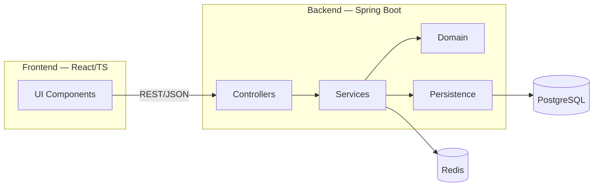

# High‑Level Design — Expense Tracker SaaS

---

## 1) General Architecture Description

Our system is a multi-layered client-server web platform for expense tracking with team collaboration capabilities. **Frontend (React + TypeScript)** interacts with **Backend (Java Spring Boot)** through REST API. **PostgreSQL** stores transactional data, **Redis** is used as cache and session/token blacklist storage. Deployment is containerized using **Docker**; authentication — **JWT**.

---

## 2) Selected Architectural Style and Rationale

* **Layered (Presentation → Application → Domain → Infrastructure)**.
* Reasons: clear structure, loose coupling between layers, easy test coverage, transaction control, possibility to evolve into modular monolith or microservices in the future.

---

## 3) Main System Components

**Frontend (React, TypeScript)**
UI with dashboards, transaction forms, categorization, and quick actions (context menu).

**Backend (Spring Boot)**
REST controllers, services with business logic, domain model, data access through JPA.

**Database (PostgreSQL)**
Relational storage for transactions and reports.

**Cache (Redis)**
Cache for analytics, rate-limit, and token blacklist.

**Security**
JWT tokens, roles (USER, MANAGER, ADMIN).

**Deployment & Infra**
Docker containers, reverse proxy (Nginx), CI/CD.

---

## 4) Component Diagram

*In the diagram:* client interacts with backend, business logic is processed in services, data is stored in Postgres, caching in Redis.

---

## 5) Key Architectural Decisions

* **PostgreSQL:** chosen over MongoDB for transactional capabilities and analytical features.
* **Modular monolith:** starting as a monolith for simplicity, but ready to split into microservices.
* **React:** chosen for flexibility and large community.
* **JWT:** easy scalability and stateless token validation.
* **Redis:** for cache and rate-limit.
* **Docker:** for containerization and easy deployment.
* **Flyway:** for controlled database migrations.
* **Prometheus + Grafana:** for monitoring and metrics.

---

## 6) Technology Stack

* **Frontend:** React, TypeScript, Vite, React Router, Recharts.
* **Backend:** Java 17, Spring Boot 3.x, Spring Security, Spring Data JPA.
* **Database:** PostgreSQL 15+.
* **Cache:** Redis 7+.
* **Infra:** Docker, Nginx, Flyway, Prometheus, Grafana.
* **Auth:** JWT (access + refresh), RBAC.

---

## 7) How Components Interact

* Frontend sends requests to Backend through REST API.
* Backend reads/writes to PostgreSQL, and also caches data in Redis.
* Authentication is implemented through JWT tokens.
* Access control is implemented through RBAC roles.
