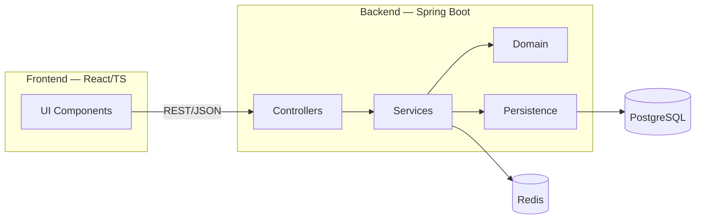

# High‑Level Design — «Expense Tracker SaaS»

---

## 1) Загальний опис архітектури

Наша система — багатошарова клієнт‑серверна веб‑платформа для обліку витрат із можливістю спільного доступу в командах. **Frontend (React + TypeScript)** взаємодіє з **Backend (Java Spring Boot)** через REST API. **PostgreSQL** зберігає транзакційні дані, **Redis** використовується як кеш і сховище сесій/токен‑чорного списку. Розгортання контейнеризоване за допомогою **Docker**; автентифікація — **JWT**.

---

## 2) Обраний архітектурний стиль і чому

* **Layered (Presentation → Application → Domain → Infrastructure)**.
* Причини: зрозуміла структура, слабке зчеплення між шарами, легке покриття тестами, контроль транзакцій, можливість еволюції до модульного моноліту або мікросервісів у майбутньому.

---

## 3) Основні компоненти системи

**Frontend (React, TypeScript)**
UI з дашбордами, формами транзакцій, категоризацією та швидкими діями (контекстне меню).

**Backend (Spring Boot)**
REST‑контролери, сервіси з бізнес‑логікою, доменна модель, доступ до даних через JPA.

**Database (PostgreSQL)**
Реляційне сховище для транзакцій і звітів.

**Cache (Redis)**
Кеш для аналітики, rate‑limit і чорний список токенів.

**Security**
JWT токени, ролі (USER, MANAGER, ADMIN).

**Deployment & Infra**
Docker‑контейнери, reverse proxy (Nginx), CI/CD.

---

## 4) Діаграма компонентів

*На діаграмі:* клієнт взаємодіє з бекендом, бізнес‑логіка обробляється в сервісах, дані зберігаються в Postgres, кешування у Redis.

---

## 5) Ключові архітектурні рішення

* **PostgreSQL:** обрали замість MongoDB через транзакційність і аналітичні можливості.
* **Модульний моноліт:** стартуємо як моноліт для простоти, але готові до розділення на мікросервіси.
* **React:** обрали через гнучкість та велику спільноту.
* **JWT:** легка масштабованість і безсерверна перевірка токенів.
* **Redis:** для кешу та rate‑limit.
* **Docker:** для контейнеризації та простого деплою.
* **Flyway:** для контрольованих міграцій БД.
* **Prometheus + Grafana:** для моніторингу та метрик.

---

## 6) Технологічний стек

* **Frontend:** React, TypeScript, Vite, React Router, Recharts.
* **Backend:** Java 21/25, Spring Boot 3.x, Spring Security, Spring Data JPA, MapStruct.
* **Database:** PostgreSQL 16+/17+.
* **Cache:** Redis 7+.
* **Infra:** Docker, Nginx, Flyway, Prometheus, Grafana.
* **Auth:** JWT (access + refresh), RBAC.

---

## 7) Як компоненти взаємодіють

* Frontend шле запити до Backend через REST API.
* Backend читає/пише в PostgreSQL, а також кешує дані у Redis.
* Аутентифікація реалізована через JWT токени.
* Керування правами доступу реалізоване через ролі RBAC.
