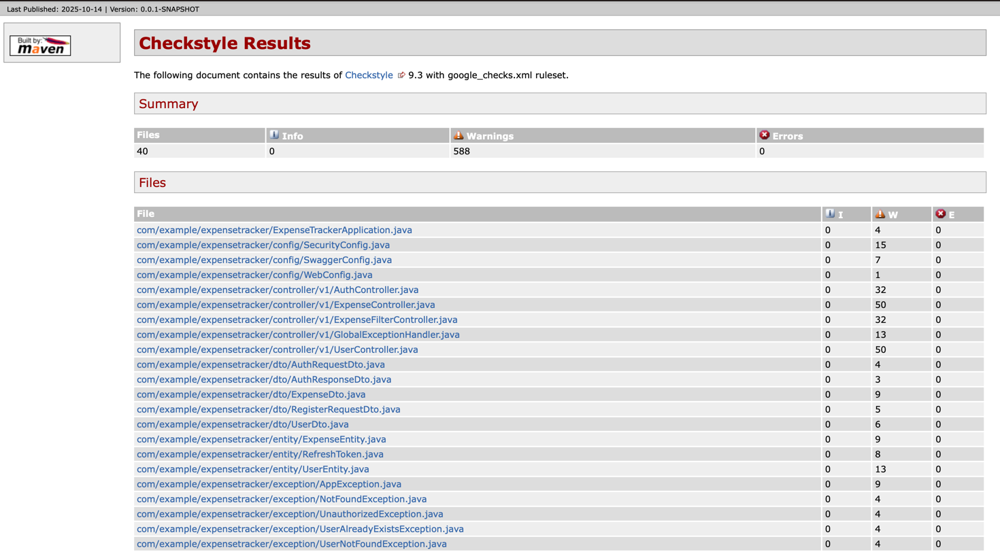

# Static Code Analysis Report

### 1. Tool and Configuration

- **Tool Name:** Checkstyle
- **Plugin Version:** 3.3.1
- **Configuration:** `google_checks.xml` (standard rule set from Google).
- **Command to run:** `mvn checkstyle:checkstyle`

### 2. Analysis Results

A total of **588 violations** were found in **40 files**.

The most common problems were:
- **Line length:** Line length exceeded 100 characters.
- **Missing Javadoc:** Missing Javadoc comments for public methods.
- **Parameter name:** Parameter name `_name` does not match pattern `^[a-z][a-zA-Z0-9]*$`.

### 3. Conclusions and Action Plan

The analysis showed that our team does not always follow a unified code formatting style, particularly regarding line length and variable naming.

**Our Action Plan:**
1.  Fix all found errors before the next commit.
2.  Configure IDE (IntelliJ IDEA, VS Code) for automatic code formatting according to Google Style rules.
3.  Agree on mandatory addition of Javadoc for all new public APIs.
